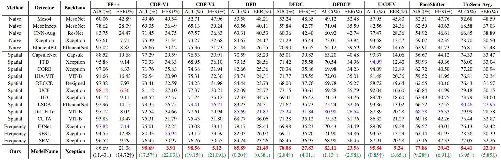

# ModelName: Deepfake face detector

[](https://creativecommons.org/licenses/by-nc/4.0/)  

<b> Authors: Ming Zhang, Yuchen Hui, <a href='https://scholar.google.com/citations?hl=zh-CN&user=y52WOmkAAAAJ&view_op=list_works&sortby=pubdate'>Xiaoguang Li*</a>, Guojia Yu, <a href='https://scholar.google.com/citations?hl=zh-CN&user=FFX0Mj4AAAAJ'>Haonan Yan</a>, <a href='https://scholar.google.com/citations?hl=zh-CN&user=oEcRS84AAAAJ&view_op=list_works&sortby=pubdate'>Hui Li*</a>  </b>

---
## 📚 **Overview**
<div align="center"> 
</div>
<div style="text-align:center;">
  
</div>

Welcome to ModelName, a highly generalizable and discriminative deepfake face detector that establishes a reliable barrier between you and the synthetic world. The following provides key information about this detector: 

> 📌 **New Perspective**: *ModelName* captures the intrinsic commonality among deepfake faces rather than relying on low-level visual artifacts, thereby maintaining strong generalization across numerous unseen scenarios.
> 
> 📌 **Perceptual Removal**: *ModelName* effectively eliminates perceptual interference embedded in facial images, enabling the extraction of purer identity representations.
> 
> 📌 **Advanced Purification**: *ModelName* suppresses irrelevant identity components while enhancing relevant ones within the extracted representation, isolating the most discriminative identity features.
> 
> 📌 **Outstanding Performance**: Extensive experiments demonstrate that *ModelName* achieves remarkable results in generalization, robustness, and identity discriminability, highlighting its potential as a universal solution for deepfake face detection.


---

## 😊 **ModelName Updates**
> - [ ] To be supplemented code after acceptance...
>
> - [x] 14/11/2025: *First version pre-released for this open source code.* 
---

<font size=4><b> Table of Contents </b></font>

- [Quick Start](#-quick-start)
  - [Environmental](#1-Environmental)
  - [Download Data](#2-download-data)
  - [Preprocessing](#3-preprocessing)
  - [Training](#4-Training)
  - [Evaluation](#5-evaluation)
- [Results](#-results)
- [Citation](#-citation)
- [Copyright](#%EF%B8%8F-license)

---

## ⏳ Quick Start

### 1. Environmental
<a href="#top">[Back to top]</a>

You can run the following script to configure the necessary environment:

```
git clone git@github.com:huiyuchen708/ModelName.git
cd ModelName
conda create -n ModelName python=3.10.16
conda activate ModelName
pip install -r requirements.txt
```

### 2. Download Data
<a href="#top">[Back to top]</a>

All datasets used in ModelName can be downloaded from their corresponding original repositories. For convenience, we provide a subset of the datasets employed in our study (the remaining ones are sourced from existing works). Each provided dataset has been preprocessed into aligned facial frames (32 frames per video) along with corresponding masks and landmarks, allowing others to directly deploy these faces for evaluating ModelName. 

The download links and detailed information for each dataset are summarized below:

| Dataset | Real Videos | Fake Videos | Total Videos | Rights Cleared | Total Subjects | Synthesis Methods | Original Repository |
| --- | --- | --- | --- | --- | --- | --- | --- |
| FaceForensics++ | 1000 | 4000 | 5000 | NO | N/A | 4 | [Hyper-link](https://github.com/ondyari/FaceForensics/tree/master/dataset) |
| FaceShifter | 1000 | 1000 | 2000 | NO | N/A | 1 | [Hyper-link](https://github.com/ondyari/FaceForensics/tree/master/dataset) |
| DeepfakeDetection | 363 | 3000 | 3363 | YES | 28 | 5 | [Hyper-link](https://github.com/ondyari/FaceForensics/tree/master/dataset) |
| Deepfake Detection Challenge (Preview) | 1131 | 4119 | 5250 | YES | 66 | 2 | [Hyper-link](https://ai.facebook.com/datasets/dfdc/) |
| Deepfake Detection Challenge | 23654 | 104500 | 128154 | YES | 960 | 8 | [Hyper-link](https://www.kaggle.com/c/deepfake-detection-challenge/data) |
| CelebDF-v1 | 408 | 795 | 1203 | NO | N/A | 1 | [Hyper-link](https://ours) |
| CelebDF-v2 | 590 | 5639 | 6229 | NO | 59 | 1 | [Hyper-link](https://ours) |
| UADFV | 49 | 49 | 98 | NO | 49 | 1 | [Hyper-link](https://ours) |

In addition, the image dataset CASIA-FACEV5 used in the evaluation can be downloaded [here](https://huggingface.co/datasets/student/FFHQ).

🛡️ **Copyright of the above datasets belongs to their original providers.**

After downloading, please store the datasets in the `datasets/rgb` directory and organize them according to the following structure. 

```
rgb
├── Celeb-DF-v2 (if you download my processed data)
|   ├── Celeb-real
|   |   ├── frames
|   |   |   ├── id0_0000
|   |   |   |   ├── 000.png
|   |   |   |   ├── ...
|   |   |   ├── idx_xxxx
|   |   |   ├── ...
|   |   ├── landmarks
|   |   |   ├── id0_0000
|   |   |   |   ├── 000.npy
|   |   |   ├── idx_xxxx
|   |   |   ├── ...
|   ├── Celeb-synthesis
|   |   ├── frames
|   |   |   ├── id0_id1_0000
|   |   |   |   ├── 000.png
|   |   |   ├── idx_idx_xxxx
|   |   |   ├── ...
|   |   ├── landmarks
|   |   |   ├── id0_id1_0000
|   |   |   |   ├── 000.npy
|   |   |   ├── idx_idx_xxxx
|   |   |   ├── ...
|   ├── YouTube-real
|   |   ├── frames
|   |   |   ├── 00000
|   |   |   |   ├── 000.png
|   |   |   ├── xxxxx
|   |   |   ├── ...
|   |   ├── landmarks
|   |   |   ├── 00000
|   |   |   |   ├── 000.npy
|   |   |   ├── xxxxx
|   |   |   ├── ...
|   ├── List_of_testing_videos.txt
├── UADFV (if you download my processed data)
|   ├── fake
|   |   ├── frames
|   |   |   ├── 0000_fake
|   |   |   |   ├── 000.png
|   |   |   ├── xxxx_fake
|   |   |   ├── ...
|   |   ├── landmarks
|   |   |   ├── 0000_fake
|   |   |   |   ├── 000.npy
|   |   |   ├── xxxx_fake
|   |   |   ├── ...
|   ├── real
|   |   ├── frames
|   |   |   ├── 0000
|   |   |   |   ├── 000.png
|   |   |   ├── xxxx
|   |   |   ├── ...
|   |   ├── landmarks
|   |   |   ├── 0000
|   |   |   |   ├── 000.npy
|   |   |   ├── xxxx
|   |   |   ├── ...
Other datasets are similar to the above structure
```

If you choose to store the datasets elsewhere, you can specify the path via `rgb_dir` in `training/test_config.yaml` and `training/train_config.yaml`. You may also specify a different location for configuration files by setting `dataset_json_folder` in the same configuration files.

### 3. Preprocessing
<a href="#top">[Back to top]</a>

To stabilize data partitioning and labeling, reduce the training cost of ModelName, and enhance its training efficiency, you should first execute the following command to unify multi-source datasets into an intuitive sample list. This operation also facilitates reproducibility for other researchers.

```
cd ModelName/generate_data
python rearrange.py
```

You can specify the datasets to be processed and their root directories in `generate_data/config.yaml`. In addition, when employing the Information Bottleneck component to extract facial identity representations, it is necessary to pre-generate the dataset distribution information to ensure dynamic adjustment of active neurons during training and to regularize the feature outputs of each layer. Please follow the steps below:

1. Navigate to the `ModelName/utils` directory and modify the `--data_root` parameter in the `compute_statistics.py` to point to the actual path where the dataset is stored.

2. Execute the `compute_statistics.py` script within the virtual environment ModelName.

3. The output weight information will be saved to the `ModelName/models` directory.

```
cd ModelName/utils
python compute_statistics.py --data_root your_dataset_path --batch_size 32
```

### 4. Training
<a href="#top">[Back to top]</a>

To start training, use the following command:

```
CUDA_VISIBLE_DEVICES=2,3 nohup torchrun --nproc_per_node=2 train.py > train.log 2>&1 &
```

Specifically, when resuming training, you can use the `--resume_checkpoint` parameter to specify the model state to restore and set the `--resume_mode` parameter to determine whether to start from a new epoch.

### 5. Evaluation
<a href="#top">[Back to top]</a>

Two evaluation scripts are provided to assess the effectiveness of the trained models:  

1. **test_iid_detector.py**: Designed for rapid inference, this script allows you to specify a directory containing facial images to be evaluated (including any custom deepfake content). It returns the detector’s prediction results for each sample.  
2. **test_eval_iid_datasets.py**: Used for comprehensive performance evaluation of the detector, this script reports aggregated metrics such as AUC, ACC, and EER across different test datasets.

In addition, we provide scripts for visualizing Figures 8 and 9 in the paper. Specifically, you can navigate to the `ModelName/tools` directory and select the desired script to execute:  

1. **visualize_cosine_iid.py**: Plots the cosine similarity between the latent-space identity representations extracted by ModelName and the corresponding surface-space identities. You need to specify the `--checkpoint` parameter to point to your pretrained weights and adjust the `--dataset` parameter to select the test set to be processed.  
2. **visualize_tsne_iid_ori.py**: Visualizes the baseline model’s ability to distinguish between real and fake samples. You can modify the `--aggregate` parameter to indicate whether the dimensionality reduction is performed based on video IDs or image IDs.  
3. **visualize_tsne_iid.py**: Visualizes the pretrained model’s discrimination capability between real and fake samples.

## 🏆 Results

<a href="#top">[Back to top]</a>

We present partial experimental results for FaceShield. For a comprehensive understanding of FaceShield's performance in terms of perceptual fidelity, facial privacy protection, and sampling efficiency, we strongly recommend referring to our [paper](xxx).

<div align="center"> 
</div>
<div style="text-align:center;">
  
</div>

These resources provide a detailed analysis of the training outcomes and offer a deeper understanding of the methodology and findings.

## 📝 Citation

<a href="#top">[Back to top]</a>

If you find our benchmark useful to your research, please cite it as follows:

```
coming soon.
```

## 🛡️ License

<a href="#top">[Back to top]</a>

If you have any suggestions, comments, or wish to contribute code or propose methods, we warmly welcome your input. Please contact us at zhangming2025@njust.edu.cn or huiyc@stu.xidian.edu.cn. We look forward to collaborating with you in pushing the boundaries of facial privacy protection.

